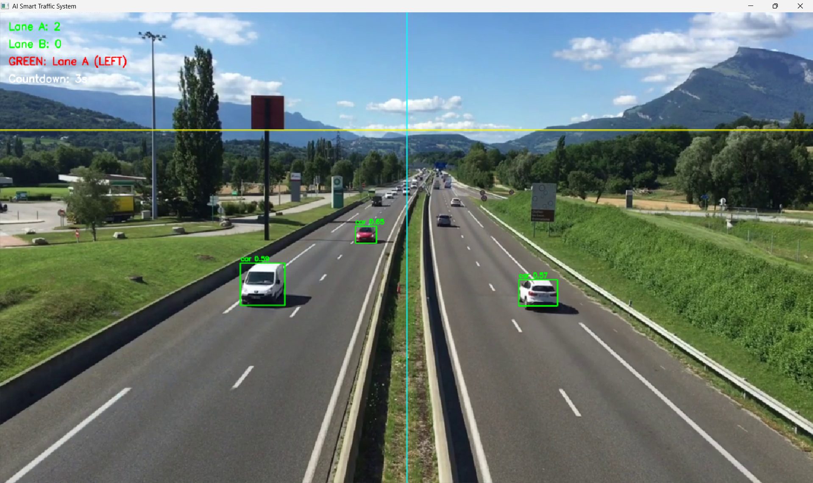
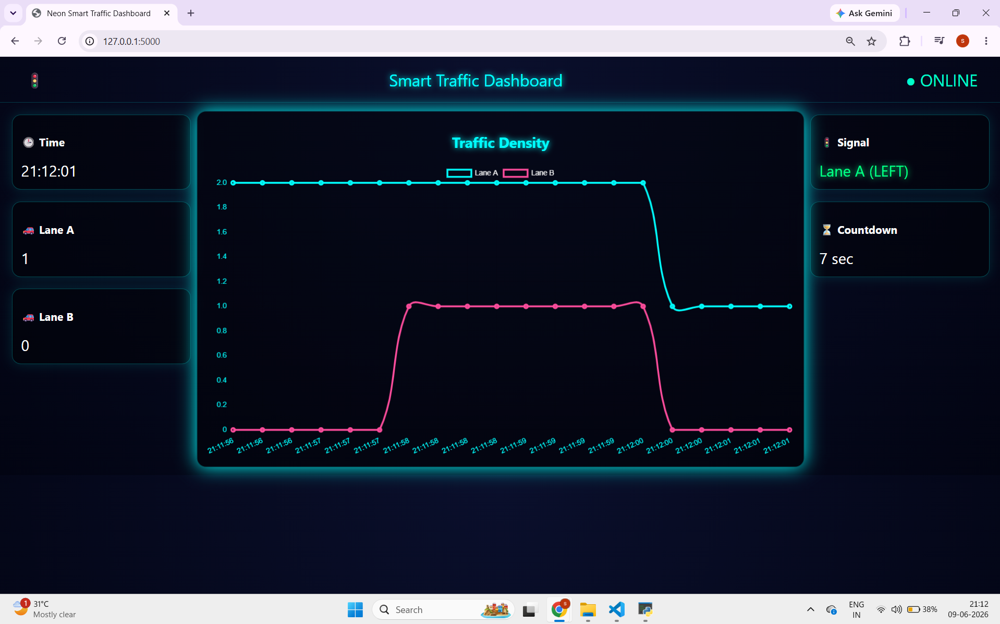
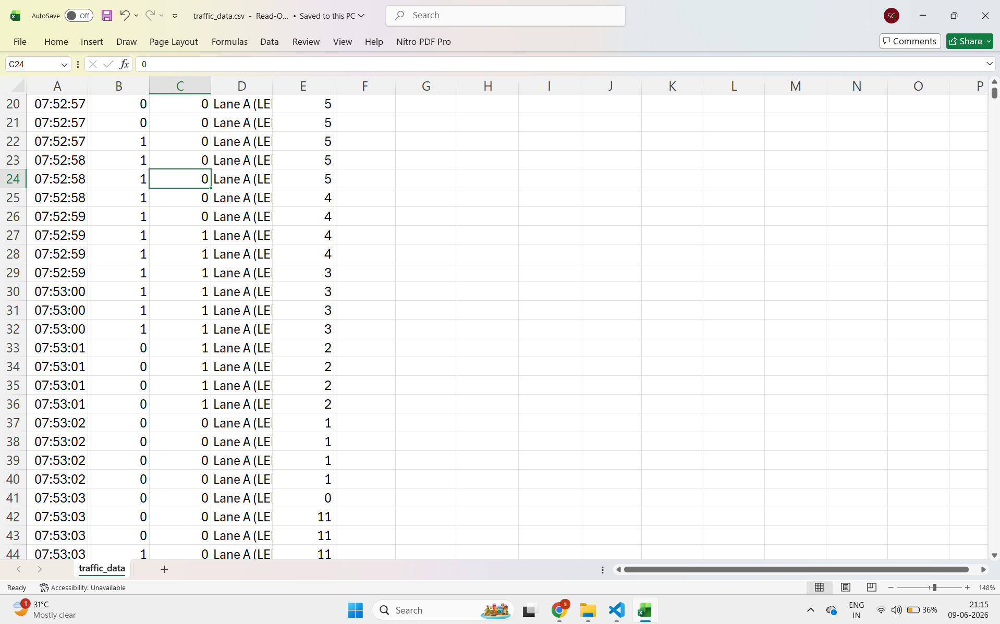

# 🚦 Smart Traffic AI System

An AI-powered traffic monitoring and analytics system that uses **YOLOv8, OpenCV, and Flask** to detect vehicles, analyze traffic density, and provide real-time insights through an interactive dashboard.

## 📌 Overview

Traffic congestion is one of the major challenges in urban areas. This project leverages Computer Vision and Artificial Intelligence to automatically detect and count vehicles from traffic footage, generate traffic analytics, and support data-driven traffic management decisions.

The system can be used as a foundation for Smart City and Intelligent Transportation applications.

---

## ✨ Features

* 🚗 Real-time vehicle detection using YOLOv8
* 🚌 Multi-class vehicle recognition (Cars, Bikes, Buses, Trucks, etc.)
* 📊 Traffic density analysis
* 📈 Dashboard for monitoring traffic statistics
* 📄 Automatic traffic data logging and CSV generation
* ⚡ Fast and lightweight implementation using Python
* 🌐 Web-based interface using Flask

---

## 🛠️ Tech Stack

### Backend

* Python
* Flask

### Computer Vision & AI

* OpenCV
* YOLOv8 (Ultralytics)

### Data Processing

* Pandas
* CSV Analytics

### Frontend

* HTML
* CSS
* JavaScript

---

## 🏗️ System Architecture

Traffic Video/Input

↓

YOLOv8 Vehicle Detection

↓

Vehicle Classification & Counting

↓

Traffic Data Processing

↓

CSV Analytics Storage

↓

Flask Dashboard

---

## 📂 Project Structure

SmartTrafficAI/

├── src/

│   ├── app.py

│   ├── detect.py

│   ├── templates/

│   │   └── dashboard.html

│

├── dataset/

├── models/

├── results/

├── requirements.txt

├── README.md

└── .gitignore

---

## 📸 Screenshots

## 🚗 Vehicle Detection

## 📊 Dashboard

## 📈 Analytics Output

---

## 🚀 Installation

### Clone Repository

git clone https://github.com/YOUR_USERNAME/Smart-Traffic-AI-System.git

cd Smart-Traffic-AI-System

### Create Virtual Environment

python -m venv venv

venv\Scripts\activate

### Install Dependencies

pip install -r requirements.txt

### Run Application

python src/app.py

Open your browser and navigate to:

http://127.0.0.1:5000

---

## 📊 Applications

* Smart Traffic Monitoring
* Traffic Density Analysis
* Smart City Solutions
* Urban Traffic Planning
* Road Infrastructure Optimization
* Transportation Analytics

---

## 🔮 Future Enhancements

* Live CCTV Camera Integration
* Cloud-based Monitoring Dashboard
* Emergency Vehicle Priority Detection
* Traffic Congestion Prediction using Machine Learning
* Real-time Alert System
* Multi-Camera Support

---

## 🎯 Learning Outcomes

Through this project, I gained practical experience in:

* Computer Vision
* Object Detection using YOLOv8
* Flask Web Development
* Data Analytics
* Python Application Development
* AI-based Traffic Monitoring Systems

---

## 👨‍💻 Author

**Shreyash Gawade**

Aspiring Software Developer | Python Developer | AI & Automation Enthusiast

GitHub: https://github.com/shreyashmgawade25-beepppp
